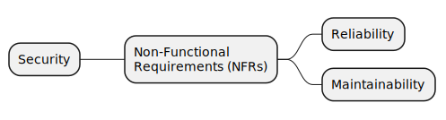

# Non-Functional Requirements Map

## The Objective of this repository

- build a non functional requirements map
- Specify concrete actions to be taken to implement the requirement
- Specify the measurement and how to measure

## References

[1 - Google Cloud Architecture Framework](https://cloud.google.com/architecture/framework)
[2 - AWS Well-Architected and the Six Pillars](https://aws.amazon.com/architecture/well-architected)

## The rendered NFR Map

